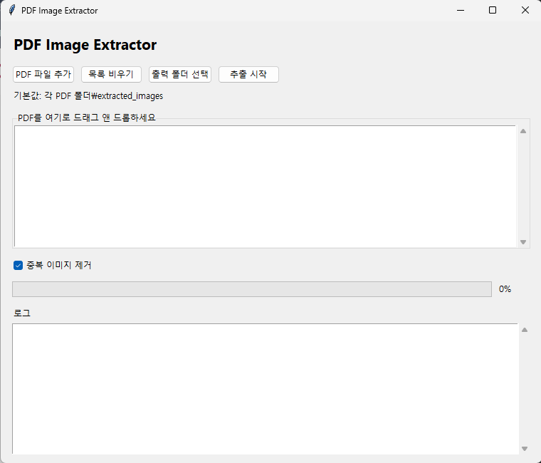

# PDF Image Extractor

## Screenshot



PDF 페이지를 이미지로 렌더링하지 않고, PDF 내부에 포함된 원본 이미지 데이터를 그대로 추출하는 Windows용 GUI 프로그램입니다.

## 주요 기능

- PDF 파일 여러 개를 한 번에 처리
- PDF 내부 원본 이미지 바이트 저장
- 원본 크기와 포맷 유지
- 드래그 앤 드롭으로 PDF 추가
- SHA256 기반 중복 이미지 제거 옵션
- PDF별 하위 폴더에 결과 저장
- 작업 진행률과 로그 표시
- PyInstaller 기반 단일 EXE 빌드

## 설치

개발 환경은 Python 3.11 이상을 권장합니다.

```bat
python -m pip install -r requirements.txt
```

## 실행

```bat
python src\main.py
```

## 사용법

1. `PDF 파일 추가` 버튼을 누르거나 PDF 파일을 창으로 드래그합니다.
2. 필요하면 `출력 폴더 선택` 버튼으로 저장 위치를 지정합니다.
3. 중복 이미지를 제외하려면 `중복 이미지 제거`를 켠 상태로 둡니다.
4. `추출 시작`을 누릅니다.
5. 결과는 PDF 파일명별 하위 폴더에 저장됩니다.

## 결과 예시

기본 출력 폴더를 지정하지 않으면 각 PDF가 있는 폴더 아래 `extracted_images` 폴더가 생성됩니다.

```text
extracted_images/
  sample1/
    sample1_p001_img001_xref12_1200x800.jpg
    sample1_p002_img002_inline_640x480.png
  sample2/
    sample2_p001_img001_xref8_900x600.png
```

## EXE 빌드

```bat
build.bat
```

빌드가 성공하면 다음 파일이 생성됩니다.

```text
dist\PDFImageExtractor.exe
```

`assets\icon.ico`가 있으면 빌드 시 아이콘으로 사용하고, 없으면 아이콘 없이 빌드합니다.

## 알려진 한계

- PDF 페이지 전체를 이미지로 렌더링하지 않습니다.
- 벡터 그래픽은 이미지 파일이 아니므로 추출 대상이 아닙니다.
- 일부 특수한 inline 이미지는 PDF 내부 저장 방식에 따라 추출되지 않을 수 있습니다.
- 암호화된 PDF는 비밀번호 입력을 지원하지 않으므로 건너뜁니다.

## 테스트

```bat
python -m unittest discover -s tests
```
